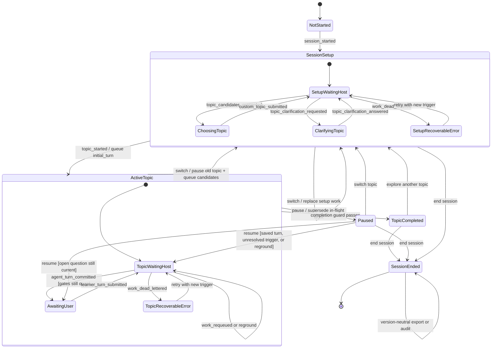
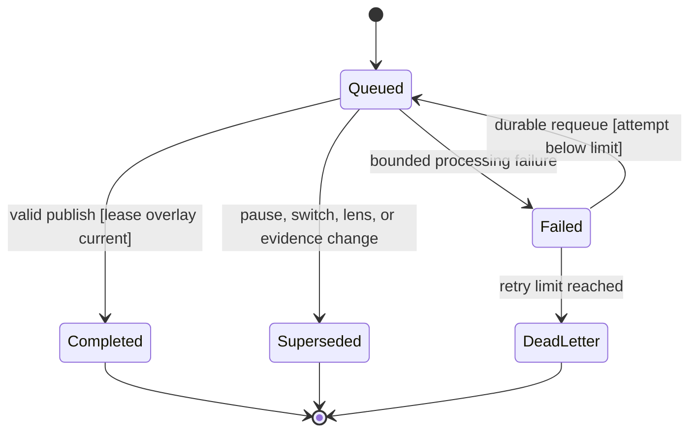
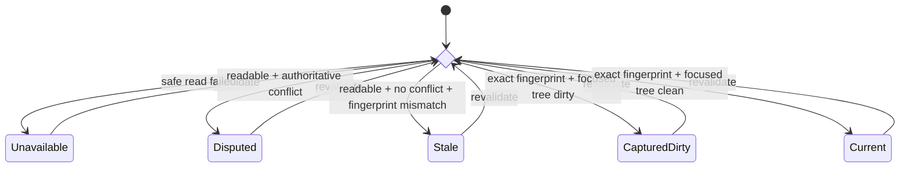
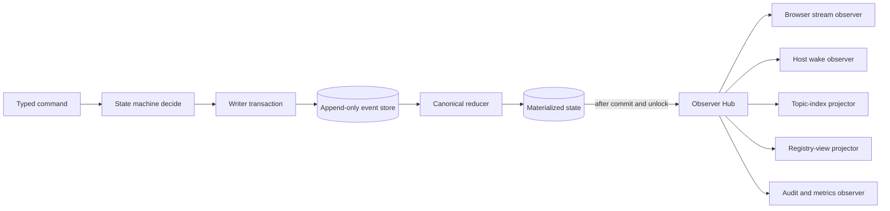

# X-Sync v2：温暖、话题驱动的连续苏格拉底对话

状态：历史 Dialogue v2 引导式对话设计。当前默认入口已改为开放式聊天，见 [Open chat runtime](../../../skills/x-sync/references/open-chat.md)；本文保留为显式引导模式的设计记录，实施进度以代码和测试为准。

日期：2026-08-15

适用仓库：`x-sync`

目标宿主：Codex、Claude Code

## 1. 背景

X-Sync v1 已经能够从仓库证据生成题库、在终端或网页答题、保存答题记录，并通过追问和教学修订帮助用户补齐知识缺口。它的诊断基础是有价值的，但默认体验仍然像一张试卷：固定题数、预制问题、单选项、信心刻度和内部教学标签会让用户关注“答对”，而不是和仓库共同推理。

v2 将默认体验从“回答五道题”改成“围绕一个话题逐步聊透”。下一问由用户刚刚表达的理解、当前话题目标和仓库证据共同决定。用户始终可以暂停、切换话题或导出收获。

这次改造不降低诊断标准。证据新鲜度、原始回答、提示依赖、争议、可恢复事件和可审计结论仍然保留，只是不再把内部评分术语直接暴露给用户。

## 2. 已确认的核心决策

| 决策 | 结果 |
| --- | --- |
| 默认产品形态 | 话题驱动的自适应连续对话 |
| 默认入口 | 裸 `$x-sync`、`/x-sync` 打开本地网页 Dialogue v2 |
| 默认方式 | 苏格拉底式、业务 × 技术、一次只问一个问题 |
| 会话长度 | 不再固定五题，由自然完成条件决定 |
| 选择题 | 不用于默认对话；仅保留在旧版 regular/快速核对流程 |
| 话题数量 | 一个 Conversation Session 可依次包含多个 Topic Run；任一时刻只有一个 active |
| 暂停 | 保存阶段成果，不视为完成或掌握 |
| 切换 | 暂停当前 Topic Run，给出仓库绑定的新候选，再继续同一网页 Session |
| 导出 | 随时生成固定 JSON + Markdown 快照，不复制完整聊天记录 |
| Host 交互 | 目标架构是浏览器写耐久事件、模型外 Host Adapter 阻塞等待；Codex 与 Claude Code 均已确认具备所需宿主能力，Claude Code 因本机无法登录而豁免真机运行验证 |
| 通道断开 | 不依赖 stdio MCP 在同一 Agent turn 内透明重连；用户输入先耐久化，页面显示等待重连，并在新 Agent turn 中继续 |
| 双宿主验收 | Codex 为 `CAPABILITY_VERIFIED + RUNTIME_PARTIALLY_VERIFIED`；Claude Code 为 `CAPABILITY_VERIFIED + LOCAL_RUNTIME_WAIVED`；两端共用同一 Runtime Core |
| token 策略 | 空闲协议不发起模型调用；每轮 X-Sync 增量 context capsule 有硬上限，宿主自身上下文不在该上限内 |
| 三方同步 | 只输出当前话题/任务的多维 readiness profile，不生成全仓库或员工单分 |
| 兼容 | v1 `sessions/`、API、事件和报告不迁移；v2 使用独立 `dialogues/` 与 `/api/v2` |

## 3. 目标与非目标

### 3.1 目标

- 让网页本身成为一段连续、友善、有温度的对话。
- 根据上一轮回答动态选择下一步，而不是播放预先排好的题目。
- 围绕一个话题从核心机制深入到边界，再落到当前仓库中的判断或改动。
- 让技术讨论追到业务后果，让业务讨论落到代码、数据和运行机制。
- 用户任何时候都能暂停、切换、求助或导出，而且不会丢失已经输入的内容。
- Codex 与 Claude Code 共享同一份运行时状态机、事件协议和输出契约。
- 保持证据化、可恢复、可审计和低 token 消耗。

### 3.2 非目标

- 不声称一个分数能衡量用户对整个仓库的理解。
- 不用于员工排名、绩效评价或跨员工比较。
- 不让网页直接持有模型密钥或调用模型 API。
- 不在 v2 中原地修改、迁移或重新解释 v1 历史事件。
- X-Sync 的 Browser/Runtime API 不提供部署、上传、登录、删除或其他外部动作；Host 最终权限仍由 Codex/Claude 平台和用户授权决定，Skill 文本本身不是强安全沙箱。
- 不保证唤醒已经结束的平台任务；只能唤醒仍在等待的 Host Adapter，或在 Host 重新连接后恢复。

## 4. 产品体验

### 4.1 启动路由

1. 解析 `-d` / `--repo` 并固定 canonical Git worktree。后续网页、Host wait、恢复和导出都沿用同一个目标。
2. 如果存在未完成的 v1 Question Session，继续按现有契约优先恢复，避免旧会话被新版入口遗弃；但用户明确要求 `new round`、新任务或新会话时可以另开。旧 session 文件不被覆盖或删除；如果新开的是 v1 round，项目级 v1 `active.json` 按现有语义移动到新 session。
3. 否则进入 Dialogue v2。
4. 第一次为该仓库开始新对话前，必须完成现有的安全全工程扫描；扫描只是 discovery inventory，不替代 focused evidence。
5. 如果 `dialogues/active.json` 指向未结束的 v2 Dialogue Session，且用户没有明确要求新 Session 或提供一个新的显式 task，则重新打开同一个 Session，并把其中未完成的 Topic Run 显示为“继续”。显式新 Session/task 创建新的 Dialogue Session，并移动 v2 active pointer；旧 Session 事件保持不变，未来仍可作为“继续”。
6. 裸入口默认启动 v2 网页；新 `dialogue start --channel terminal` 可渲染相同的 Topic 协议到终端。
7. 现有显式 `start`、question bank、`--style regular`、`--count` 与 API v1 继续属于 Quiz v1。`count=5` 只适用于 v1。

### 4.2 启动话题候选

启动页最多显示四个候选：

- 最多一个“继续”：之前暂停或未完成的话题；
- 最多一个“回顾”：已经到期、证据发生变化或值得延迟复习的话题；
- 其余为“新话题”：来自当前任务、近期 commit、重要 spec/ADR、bug fix、核心代码或覆盖缺口；
- 如果某类不存在，用新的仓库绑定话题补足；
- 突出一个推荐候选，并用一句话说明“为什么现在值得聊”，但选择不计分。

如果用户带着显式 task 启动，该 task 是本次新候选的硬 scope，默认推荐必须直接来自该 task。与 task 无关的旧话题不占用新候选名额；用户仍可从历史入口另行继续它。

候选来源覆盖：Spec、Story、详细设计、业务文档、ADR、commit 决策、bug fix、代码、测试、基础设施，以及与仓库任务直接相关的框架、存储、网络、OS、性能、事务和非功能需求。业务意图优先从业务文档和 spec 获取，不在存在权威文档时只靠代码倒推。

用户也可以输入自定义话题。如果表达含糊，Agent 先澄清范围，再创建 Topic Contract。

### 4.3 起始视角

话题选定后，给用户三个起点：

- 业务路径：资深 BA/SA 视角，从目标、术语、流程和业务承诺走到实现；
- 技术路径：资深架构师视角，从系统机制、约束和失败模式走到业务后果；
- 业务 × 技术：默认推荐，允许在两侧自然往返。

视角只决定从哪里进入，不把业务和技术拆成两个互斥频道。对话中可以随时切换视角。

### 4.4 一轮对话

用户每次只看到一段自然回复和一个新问题。内部结构为：

1. `heard`：准确复述用户现在的理解；
2. `one_step_further`：指出唯一最值得确认的缺口、因果或边界；
3. `question`：一个开放问题。

网页不展示这些字段名，而是渲染成两到三个自然短段落。普通推进回合必须恰好包含一个 `question` 字段；暂停、切换总结或完成回合必须没有问题。

页面常驻动作：

- `继续聊`
- `给我一点线索`
- `这部分请你先讲`
- `先停在这里`
- `换个话题`
- `导出收获`

输入框提示：`先说你现在怎么理解，不用组织成标准答案。`

不显示 `1/5`、L1、H4、rubric、correctness、分数、“测试已中断”、“保存答案”或“正式重答”等内部语言。

### 4.5 语气

- 像耐心、具体、平等的资深同事，而不是考官。
- 温度来自准确回应和用户控制权，不来自空泛夸奖、卖萌或 emoji。
- 不说“太棒了”“完全正确”，而是明确用户抓住了什么、还差哪一环。
- 不把 gap 人格化，不说“你不行”或“你没掌握”；说“这里还差一块证据”或“这个边界还没确认”。
- 技术问题要追问业务影响；业务问题要落到代码、状态、数据和运行机制。
- 仓库依据折叠在 `我是根据这些判断的（N）` 下方。

### 4.6 求助与信心

求助是对话动作，不是失败：

- 第一次只给最小线索；
- 再次请求时逐步增加信息；
- 用户可以直接选择“这部分请你先讲”；
- 界面不展示 H1/H4，但内部继续记录提示依赖；
- 经提示形成的理解标为 `assisted`，需要在新的变式或应用场景中独立表达后，才能视为 `supported`。

把握度不再每轮强制填写。只在话题开始和最终归纳时可选采集自然语言状态：

`先试着说 / 还在推敲 / 有点把握 / 比较确定 / 能讲给别人`

界面不显示数字或“信心校准”术语。

### 4.7 暂停、切换与完成

暂停立即生效，不设置劝留确认：

- Topic Run 进入 `paused`；
- 保存目前确认的理解、开放问题、提示依赖和下次入口；
- 给出一句“先带走这句话”；
- 不将暂停写成 completed 或 mastered。

暂停小结由 Runtime 从已经提交的 insight ledger、gate 状态和最高优先缺口确定性生成，不等待新的模型调用。因此 Host 离线时也能立即暂停并拿到小结；尚未复核的最新原话会明确标成 `working_model`。

切换话题时：

1. 原 Topic Run 以 `reason=switched` 暂停；
2. 保存阶段总结；
3. 返回 2–3 个有仓库依据的候选，并允许自定义；
4. 在同一 Conversation Session 中启动新的 Topic Run。

自然完成不依赖轮数。三个 required gate 都必须在当前证据下为 `supported`：

- `mechanism`：能用自己的话说明核心机制，以及它服务的业务目标；
- `boundary`：能处理至少一个失败场景、反例或适用边界；
- `repository_application`：能将理解用于当前仓库中的判断、修改位置或验证方式。

此外，至少有一条业务—技术映射被确认，且相关 evidence health 为 `current`，或为经过精确内容复验并明确绑定 dirty snapshot 的 `captured_dirty`。若某门槛是在直接讲解后达到 `assisted`，必须再用新的场景独立验证，才能转为 `supported`。

完成或暂停都给短小总结，包含：已对齐、仍待确认、下一步，以及一句带走的话。

## 5. 自适应对话策略

### 5.1 Topic Contract

每个 Topic Run 开始时创建不可变 Topic Contract：

```json
{
  "contract_id": "contract.opaque",
  "contract_version": 1,
  "topic_run_id": "topic-run.opaque",
  "title": "网页回答后，怎样可靠地唤醒 Codex / Claude Code？",
  "guiding_question": "连续对话的可靠边界是什么？",
  "objective": "用户留在网页中完成可恢复的连续对话",
  "task_scope": "让浏览器回答自动唤醒 Host",
  "starting_lens": "mixed",
  "bridge_required": true,
  "evidence_refs": ["ev.focused.1"],
  "gates": [
    {"id": "mechanism", "required": true},
    {"id": "boundary", "required": true},
    {"id": "repository_application", "required": true}
  ]
}
```

如果话题范围实质变化，创建新 contract version，并使用 `supersedes_contract_id` 关联；不覆盖旧 contract。

### 5.2 Gate 状态

Gate 使用：

```text
unexplored | emerging | assisted | supported | stale | disputed
```

`supported` 只表示“在本次话题、当前仓库版本下，有用户表达和仓库证据共同支持”，不是对整个领域的永久掌握声明。

### 5.3 每轮判断顺序

Runtime 先处理确定性控制，Host 再做语义判断：

1. `pause`：立即暂停并 supersede 在途 work；
2. `switch`：暂停当前话题，生成新的候选；
3. `export`：导出本身 version-neutral；如果导出前复验引起 evidence 状态变化，先按第 13 节推进版本，再从新状态生成快照；
4. `help`：给最小必要线索，不记作失败；
5. 普通回答：进入下列语义判断。

普通回答的语义顺序：

1. 复验本轮相关证据；
2. 提取用户主张，更新 `confirmed / working_model / open_question / stale / disputed`；
3. 一次只选一个最影响后续理解的缺口；
4. 若当前 gate 已 supported，进入下一个未完成 gate；
5. 若连续两轮停留在技术侧，优先补业务后果；若连续两轮停留在业务侧，优先落到实现；
6. 三个 gate 和业务—技术映射都满足时自然完成。

Agent 可选择的单轮意图：

```text
clarify | causal_trace | assumption_test | counterexample |
evidence_locate | business_technical_bridge | repository_apply | synthesize
```

它们不是固定流水线。每轮只选择当前最有区分度的一种。同一缺口最多追问两次；仍不清楚时先做微型讲解，再换一个新场景验证。

### 5.4 用户当前理解模型

每条 learner-model entry 使用：

```json
{
  "entry_id": "model-entry.opaque",
  "kind": "business_technical_mapping",
  "statement": "耐久事件把网页承诺与 Host 生命周期解耦",
  "status": "working_model",
  "provenance": "agent_inferred",
  "turn_refs": ["turn.opaque"],
  "evidence_refs": ["ev.focused.1"]
}
```

`kind`：

- `technical_conclusion`
- `business_insight`
- `business_technical_mapping`
- `boundary`
- `open_question`

`status`：

- `confirmed`
- `working_model`
- `open_question`
- `stale`
- `disputed`

`provenance`：

- `learner_explicit`
- `agent_inferred`
- `jointly_confirmed`

Agent 的推测只能进入 `working_model`。没有用户表达或后续确认，不能升级为 `confirmed`。

## 6. 架构

### 6.1 组件

```text
Browser UI
  │  HTTP commands + authenticated fetch stream
  ▼
Local X-Sync Runtime
  │  single session daemon + append-only dialogue events + work queue
  ▼
Host Adapter / Supervisor
  │  blocking wait → claim → context capsule → publish
  ▼
Codex or Claude Code
```

- Browser UI：展示候选、对话、状态、暂停/切换/导出；不直接调用模型。
- Runtime daemon：每个 active Dialogue Session 只有一个写入 daemon；负责幂等、版本、reducer、证据复验、导出与浏览器 view model。Browser HTTP 和 Host CLI 都通过它提交命令，不直接改事件文件。
- Host Adapter Supervisor：在模型外长期存活，阻塞等待 work、持有并自动续租 lease、为 Codex/Claude 提供同一结构化 envelope；模型本身不负责 heartbeat。
- Codex/Claude：读取紧凑上下文和必要证据，生成结构化 Agent result。

Host CLI 通过 session-private 本地 IPC 连接 Runtime daemon。Unix 使用权限受限的 Unix domain socket；其他平台使用具有等价 OS-user 边界的 named pipe 或受限 loopback control endpoint。daemon 用 per-session singleton lock 防止第二个 writer 启动。Runtime 重启时先验证事件链并恢复投影，再重新创建 IPC。

### 6.2 真正唤醒的可行性边界

Skill 文本本身不能唤醒已经结束的 Codex/Claude 任务。当宿主允许一个尚未 final 的 Agent turn 保持 pending tool channel 时，连续网页体验可以同时满足：

- 同一个尚未 final 的 Agent turn 持有平台公开支持的 pending tool channel；
- 该 channel 连接一个模型外长期存活的 Host Adapter Supervisor，Supervisor 阻塞等待、持有 lease，并在 work 到达时把结果返回到这个 Agent turn。

协议层的目标是用户空闲时不主动发起模型调用；宿主可能注入的上下文、内部调度与总 token 只能观测，不能由 X-Sync 单方面保证。空闲期间仍会有本地等待进程、HTTP keepalive 或文件系统事件。

双宿主的必须验收门槛是 capability compatibility：官方公开能力必须支持 Skill 发现、stdio MCP/等价工具通道、流式非交互调用和长时工具运行，且两个 adapter 必须通过同一本地协议 harness。当机器具备账号与凭据时，再执行下列真机 observational matrix；本机无法登录 Claude Code，所以 Claude Code 真机运行按明确的 `LOCAL_RUNTIME_WAIVED` 记录，不阻塞共享内核实现：

1. Codex：同一个未 final turn 内连续完成至少三个 browser → Host → browser 回合；
2. Claude Code：同一个未 final turn 内用同一协议连续完成至少三个回合；
3. 观测空闲跨过 lease renewal、pause/switch、tool channel 取消与重新连接，但不把 stdio 透明重连当作产品正确性前提。

如果某宿主只能在新的 Codex/Claude turn 中处理 work，必须诚实标记为重连后恢复，不能描述为“唤醒当前任务”。它只消费新 turn 实际需要的模型 token，空闲协议本身不主动轮询模型。

如果 Host 已结束或 Adapter 断开，网页显示“回答已经保存，等待搭档重新连接”，不能无限 spinner，也不能要求用户重新输入。Host 重连后从未确认 work 继续。

### 6.3 状态机模式是领域内核

v2 的会话、Topic Run、Work 和 evidence health 必须以显式状态机实现，不能把状态散落成一组互相独立的布尔字段，也不能在 HTTP handler、Host Adapter、Observer 或页面代码里复制迁移规则。

每次语义写入都遵循同一个函数形状：

```text
decide(current_state, typed_command, immutable_context)
  -> rejected(stable_error)
  | accepted(domain_events)

reduce(current_state, domain_event)
  -> next_state

plan_effects(prepared_event_batch)
  -> durable_effect_intents
```

- `decide` 只做 guard、选择迁移和产生领域事件；它不读写文件、不取当前时间、不生成随机数。时间、id、evidence snapshot 和 registry generation 由调用方作为不可变输入注入。
- `reduce` 是唯一能从事件得到 canonical state 的函数。正常提交和故障重放必须调用同一 reducer，不能维护第二套“恢复专用”逻辑。
- 允许的 `(state, command) -> transition` 用显式 transition table 或按状态分组的 typed handler 注册；未知组合一律返回稳定的 `TOPIC_STATE_CONFLICT`，不能落入宽松的默认分支。
- guard 只依赖当前 state、command 和冻结上下文；action 只返回领域事件。任何 I/O 都在状态机之外完成，并在 commit 前重新校验其 digest、version 和 registry generation。
- 需要后置副作用的命令由独立纯函数 `plan_effects` 根据已分配 event id 但尚未提交的 prepared batch 产生 typed durable intent。这使 intent id 可稳定绑定 originating event，同时不让 reducer 或 Observer 承担副作用规则。第一个纯内核切片只覆盖不产生外部副作用的状态迁移，因此暂不声明空的 effect 占位类型。
- `lifecycle`、`phase`、`evidence_health` 和 Work state 是正交但有交叉不变量的有限状态；状态机在每次迁移后统一验证这些不变量。

Effect intent 不是只存在进程内的返回值。每个 intent 都使用由 `originating_event_id + effect_kind + canonical_payload_digest` 派生的稳定 `intent_id`，并与产生它的 event batch 和 transaction commit marker 原子持久化。未完成 intent 是“已提交 intent 减去已提交 completion receipt/event”的可重放视图，不依赖一次性内存队列。`plan_effects` 与 event 一起在 transaction marker 的线性化点前执行；Effect Executor 以 `intent_id` 幂等 claim，执行可恢复的副作用，再用稳定 `command_id/causation_id` 提交 typed completion command；重启后从 durable log 补扫未完成 intent。若崩溃发生在文件副作用完成、completion command 落盘之前，Executor 必须依靠稳定 artifact id、commit marker 和 content hash 识别已完成结果，不得重复产生新导出物。

主对话状态机如下。`ActiveTopic` 是复合状态；从它发出的 `pause`、`switch` 和完成迁移对其中任意子状态都有效：



自然完成不是某个 turn 数触发，而是一个明确 guard：

```text
mechanism == supported
and boundary == supported
and repository_application == supported
and business_technical_mapping == confirmed
and evidence_health in {current, captured_dirty_after_exact_recheck}
```

`captured_dirty_after_exact_recheck` 是完成判断时的内部 guard 结果，不新增持久化 evidence enum；持久化仍使用第 7 节定义的 `captured_dirty`，并记录精确复验 fingerprint。

Work 与 evidence health 使用各自的小状态机，避免把租约失败或证据变化误装成对话回答：





上图的 choice guard 按列出的判定条件互斥，而不是优先级相同的模糊标签：先判断能否安全读取，再判断权威冲突，再比较 cited fingerprint，最后才按 focused tree clean/dirty 分流。相同冻结输入只能得到一个 evidence-health next state。

### 6.4 观察者模式只传播已提交事实

状态机完成 transaction、领域事件已经 `fsync + atomic rename`、canonical reducer 已得到可重放 state 之后，Runtime 才向 Observer Hub 发布不可变的 `CommittedEvent`。Observer 不能参与 guard，不能改 canonical state，不能持有可变 state 引用，也不能让领域提交依赖某个 Observer 是否在线。



Observer 契约：

- 只接收 `stream_kind + stream_id + sequence + event_id + immutable payload view`；Dialogue stream 另带 `session_id`，Registry stream 不伪造 session id。Observer 必须声明可接受的 `stream_kind`，Dialogue Observer 永远不会收到 Registry event，反之亦然。同一 event stream 按 sequence 有序，跨 Session 或 registry stream 不承诺全局顺序。跨 stream 投影保存 `{stream_id: last_sequence}` vector cursor，不能用单个全局 watermark 猜顺序。
- 交付语义是 at-least-once。持久化 Observer 用 `event_id` 和 per-stream cursor 幂等；临时 Observer（SSE、进程内 wakeup）允许断开后从 event cursor 恢复。发现 sequence gap 时停止消费并从 durable log/state resync，不能跳过或自行重排。
- 一个 Observer 失败不能回滚已经提交的领域事件，也不能阻塞其他 Observer。持久化投影失败时记录 lag/error，随后从事件链 catch up；SSE 慢消费者使用有界队列，超出游标保留窗口后返回 `CURSOR_EXPIRED` 并重新读取 state。
- Observer dispatch 必须发生在 session writer 与 registry lock 全部释放之后。callback 内禁止同步调用 `decide`、禁止递归 publish、禁止执行模型推理或长时间 I/O；dispatcher 设置 reentrancy guard，新到 event 只能进入 FIFO 队尾。Host wake Observer 只唤醒已经耐久化的 work；模型处理发生在 Supervisor/Host 边界之外。
- 需要持久化投影的 Observer callback 只向自己的有界、可 coalesce worker lane 提交 `stream_id + through_sequence` 通知，不在 dispatch 线程直接写盘。worker 从 durable log 补读事件，在独立 derived-view lock 下原子更新 projection 与 cursor；慢速/失败 worker 不阻塞其他 Observer 或 command response。这类 worker 只能重建可删除投影，不是 Effect Executor，不得提交领域 command。
- Observer 之间不能依赖注册顺序、互相调用或等待。每个 Observer 只获得 read-only DTO 和自己的 projection/notification port；不向它注入 EventWriter、SessionStore mutation API、CommandBus 或 Runtime Core。
- 如果后置 workflow 必须产生新的领域变化（例如 export worker 完成两份文件后提交 `export_completed`），由 Observer Hub 之外的 Effect Executor 消费与 event batch 原子落盘的 durable effect intent；它在原 transaction 与 observer dispatch 都结束后，使用稳定 `intent_id/command_id/causation_id` 向 command inbox 排队 typed command。普通 effect-generated semantic command 重新经过完整状态机、conversation CAS、current registry generation 和幂等校验；下一条所述的 `IntentCompletionCommand` 是唯一 authority-scoped 例外，只做 intent/receipt/artifact/session 校验与 version-neutral append。Observer callback 本身永远不持有 CommandBus。Executor 的 claim/cursor/retry 与 completion receipt 都必须可从 durable log 恢复。
- Effect completion 使用受限的 `IntentCompletionAuthority`，不冒充 Browser/Host 语义 command。它先按 `intent_id` 查 durable receipt，再校验原始 intent、`as_of_event_sequence`、artifact path/hash/size 和 Session 归属；不要求原始 conversation version 或 registry generation 仍是当前值。因此正常对话并发、deactivation 或 Session end 不会让已落盘 intent 永久卡住。completion event 在提交时使用当前 `from_version == to_version`，允许追加到 deactivating/deactivated/ended Session，但绝不得改变 Topic、gate、learner model 或 current pointer。
- `state.json` 的 canonical reducer 不是 Observer；它与 event commit 属于领域 transaction。`topic-index.json`、`active.json`、Browser stream、Host wake 和 telemetry 才是可删除、可重放或可丢弃的 Observer 输出。

首版只注册上述五类 Observer，不提供任意插件执行仓库命令的通用 hook。增加 Observer 必须声明输入事件、输出边界、cursor、失败策略和重放测试。

## 7. 持久化模型

### 7.1 目录

```text
.x-sync/
  repositories/<repo-id>/
    scan.json
  evidence/
    <focused-evidence-id>.json
  users/<learner>/projects/<repo-id>/
    sessions/                         # v1，保持原样
    dialogues/
      active.json                     # 从 registry 重建的指针
      registry/
        events/
          <registry-sequence>-<event-id>.json
        transactions/
          <first>-<last>-<transaction-id>.json  # registry commit marker
        state.json                    # 可重建 registry 投影
      <session-id>/
        config.json                   # 创建后不可变
        evidence/
          <evidence-snapshot-id>.json
        events/
          <sequence>-<event-id>.json
        transactions/
          <first>-<last>-<transaction-id>.json  # event hashes + durable effect intents
        state.json                    # 可重建投影
        runtime/
          leases/                     # 临时协调状态，不可移植
    topic-index.json                  # 可从 v2 事件重建的跨会话索引
    exports/<session-id>/
      insights.<timestamp>-<export-id>.json
      insights.<timestamp>-<export-id>.md
      latest.json
```

v2 使用独立 `schema_version: 2` 和 `protocol_version: "x-sync-dialogue/2"`。现有 repository scan 和 focused evidence 保留自己的 v1 schema，通过明确引用接入 v2。

事件、transaction commit marker 和证据快照不可变。事件只有在同 stream 的 marker 列出其 sequence、event id 和 hash 后才是已提交事实；marker 是所有 event 文件与 durable effect intent 落盘后的单一线性化点。未被 marker 引用的 event 或临时文件在恢复时隔离，不进入 reducer。`state.json`、`active.json`、`topic-index.json`、`latest.json` 和 leases 都是可重建或临时视图，不是事实来源。

共享的 v1 focused evidence 不能直接视为不可变历史事实：现有 evidence id 没有覆盖所有 claim metadata。Topic Run 开始时，v2 必须把完整 canonical v1 record、原始 content hash 和 `imported_from` 一起冻结到该 Dialogue Session 的 `evidence/`，并用完整 canonical snapshot 计算新的 snapshot id。后续只引用该 v2 snapshot，不信任共享 v1 文件的可变 metadata。

v2 不复用 v1 `Store.mutate`、每事件嵌入完整 `state_after` 或每次全量 glob/replay 的写路径。它使用 delta event、per-session singleton writer/lock、`state.json.last_sequence` 的 O(1) sequence 分配和独立 export sequence。正常写入只做增量 reducer；启动、显式校验和故障恢复才全量重放。未来如加入 checkpoint，它仍是可验证、可删除的缓存。

### 7.2 Conversation Session 与 Topic Run

一个 Dialogue Session 对应一次连续网页体验，可以包含多个 Topic Run。Session config 保存目标仓库、initial invocation scope、channel、语言和导出范围；每个 Topic Contract 保存该 Topic Run 实际的 `task_scope`。同一网页里切换到不同话题时，不修改 immutable Session config。

未结束 Session 由 `dialogues/active.json` 重新打开。所有非当前 Session（无论 paused、unfinished 或 ended）都视为历史来源：用户在当前 Session 选择“继续”或“回顾”时，创建新的 linked Topic Run，并记录 `continues_from` 或 `reviews`，不跨 daemon 向源 Session 追加对话事件。

当 registry 要把 active pointer 从 Session A 移到 B 时，使用可恢复的两阶段 fence：

1. 在 exclusive registry lock 下先追加 `dialogue_deactivation_started`，分配新的 fence generation 和目标 Session B；从该事件 durable 起，A 进入 `deactivating`，所有 Browser semantic mutation、Host claim 和 publish 都必须校验 registry generation 并拒绝旧 A generation。A 只允许 read、version-neutral export/audit 和 handoff recovery。
2. A writer 再按当前状态 quiesce：存在 active Topic Run 时追加 `topic_paused(reason=session_deactivated)`；没有 active Topic 但仍有 candidate/custom/clarification/pending work 时追加 session-level `session_deactivation_prepared` 并 supersede work；已经 paused/completed/phase=none 且没有 pending work 时，当前 `last_sequence` 本身就是 quiesce proof，不需要伪造新的 pause event。A daemon 不在线时，registry coordinator 恢复临时 writer 完成该步骤。
3. A 已 prepared 后，registry 才追加 `dialogue_deactivated` 和 `dialogue_activated`，更新 derived `active.json` 并开放 B。

如果进程在 started 与 committed 之间崩溃，registry replay 会保持 A fenced，并由 recovery coordinator 继续完成同一个 generation 的 quiesce/activate，不能临时恢复 A 写权限。旧页面收到稳定 `SESSION_DEACTIVATED`，以及当前 Session 的重新连接入口。

Session end 复用同一套可恢复 fence，不能分别“顺手”写 Dialogue 和 Registry 两个 stream。Coordinator 先在 exclusive registry lock 下追加 `dialogue_deactivation_started(target_session_id=null, reason=session_end)` 并推进 fence generation；再按上述规则 quiesce A，在 Dialogue stream 追加 `session_ended`；最后用该 Dialogue event 的 sequence/hash/state digest 作 proof，向 Registry stream 追加 `dialogue_ended` 并清空 current pointer。任一步崩溃后，registry replay 都保持旧 Session fenced，recovery coordinator 以同一 generation 幂等续完。Dialogue `session_ended` 已落盘、Registry `dialogue_ended` 尚未落盘的短暂窗口可显示为 `current-but-deactivating`，但它已被 fence，不得接受语义写入，Runtime 必须在开放 command 前先续完 recovery。不得在 Dialogue 尚未 ended 时独自清空 registry。

锁顺序固定为 `registry → session writer`。所有 semantic Browser command、Host claim 和 publish 在最终分配 claim/sequence 或 rename event 前，必须持有 registry shared/read lock（不支持 shared lock 的平台使用同一 exclusive lock），在锁内复验 current Session + generation，并保持该锁直到 session event/claim durable 后才释放。handoff 从 `deactivation_started` 到 activate B 全程持有 exclusive registry lock；崩溃释放 OS lock，但 durable started 仍保持 fence，恢复者重新获得 exclusive lock 后续完。这样“命令先检查、fence 后才 append”的 TOCTOU 不存在。

已经结束的 Session 不再追加会改变对话语义的 turn/topic 事件。结束后仍允许追加 version-neutral 的 export/audit 事件，使用户可以从历史页面再次导出；这些事件不能改变 gate、learner model 或结束时的对话状态。

Session resolve/create/deactivate/end 的 registry event commit 必须使用 project+learner registry lock、registry generation 与 CAS；每次 `dialogue_created | dialogue_deactivation_started | dialogue_deactivated | dialogue_activated | dialogue_ended` 都写入 append-only registry event。`active.json` 只是 Registry-view Observer 在所有 domain lock 释放后更新的 derived projection：Observer 使用独立 derived-view lock 和 cursor CAS，可由最大有效 generation 重建，而不是从各 Session 时间戳猜测。session 内事件仍由 per-session daemon 串行写入。两个并发裸启动只能复用同一个 resolved Session 或明确返回冲突，不能各自创建 active orphan。

每个 Topic Run 独立保存：

- Topic Contract；
- 当前 lens；
- learner model；
- gate assessment；
- evidence health；
- hint dependency；
- pause/resume context：使用显式 tagged union `open_question | unreviewed_turn | unresolved_trigger | recoverable_error`，各分支分别保存问题/turn、trigger kind/digest，或 recoverable error 与允许的 recovery actions；一次暂停恰好命中一个分支；
- lifecycle 与阶段总结。

处理阶段属于 Dialogue Session aggregate，因为候选和澄清发生在 Topic Run 存在之前；Topic Run 不另存一份可与 Session 分叉的 phase。候选项不是 `proposed` Topic Run，话题切换后的旧 work 使用 `superseded`，而 Topic Run 本身使用 `paused`。规范词表为：

```text
session_lifecycle: new | open | ended
topic_lifecycle: active | paused | completed
session_phase: choosing_topic | clarifying_topic | awaiting_user | waiting_host | recoverable_error | none
evidence_health: current | captured_dirty | stale | disputed | unavailable
```

`host_thinking`、`leased` 和 `summarizing` 只属于当前 `runtime_epoch` 下的 coordination/view overlay：分别由有效 lease 和 `work.kind=topic_summary` 派生，不写入 canonical dialogue phase。Runtime 重启后 overlay 消失，未完成 durable work 仍归约为 `queued + waiting_host`，不需要伪造对话事件。

任一 Conversation Session 最多一个 active Topic Run，任一 Topic Run 最多一个 pending learner turn 和一个 runnable work；处于候选/澄清阶段的 Session 最多一个 session-level custom-topic turn 和一个 candidate/clarification work。

### 7.3 Topic index 与延迟复习

`topic-index.json` 是跨 session 的可重建索引，用于生成“继续 / 回顾 / 新话题”：

- 最新 Topic Run 引用和阶段总结；
- 三个 gate 状态；
- hint dependency；
- evidence fingerprint 和 freshness；
- 最近接触时间；
- delayed retrieval 记录与 `due_at`；
- 与当前任务的相关性。

多个 Session daemon 可能同时结束或暂停话题。它们不能直接用“最后写入者获胜”覆盖 topic index：更新必须在 project-level derived-view lock 下按 per-stream vector cursor 做 CAS/retry；发现任一 stream sequence 缺口时删除并从 Dialogue event 重建。Registry event 另有独立、严格递增的 `registry_sequence`；`generation` 只做 fencing，不能兼任同一 generation 内事件的排序键。

同一 session 内的重复成功不能冒充保持。只有延迟、尽量无提示的重新表达才能提高 retention；复习节奏复用现有约 1、3、7、14、30 天的原则，并由实际表现调整。

## 8. 事件与并发协议

### 8.1 事件头

```json
{
  "schema_version": 2,
  "record_type": "dialogue_event",
  "protocol_version": "x-sync-dialogue/2",
  "event_id": "evt.opaque",
  "session_id": "dlg.opaque",
  "sequence": 31,
  "from_version": 8,
  "to_version": 9,
  "event_type": "learner_turn_submitted",
  "occurred_at": "2026-08-15T10:20:00+08:00",
  "actor": {"type": "learner", "id": "user.local"},
  "command_id": "cmd.opaque",
  "causation_id": "evt.previous",
  "payload": {},
  "prev_event_hash": "sha256:...",
  "integrity_hash": "sha256:..."
}
```

Runtime 是唯一事件写入者。写命令统一携带：

- `command_id`
- `session_id`
- `expected_conversation_version`
- `parent_turn_id`（适用时）
- canonical payload hash

`IntentCompletionCommand` 是唯一不携带 `expected_conversation_version` 的写命令；它携带 `intent_id + as_of_event_sequence + artifact_digest`，只能产生 version-neutral completion event/receipt。其他写命令仍必须按上述字段做 CAS。

所有会改变对话语义的 Browser command、Host claim 和 publish 还必须绑定并校验 project+learner registry generation；处于 `deactivating`、非当前或 generation 过期的 Session 只能 read/export/audit，其他操作返回 `SESSION_DEACTIVATED`。

处理顺序：

1. 先查 `command_id`；相同 key + 相同 body 返回第一次结果；
2. 相同 key + 不同 body 拒绝为 `IDEMPOTENCY_CONFLICT`；
3. 再检查 conversation version 和 parent turn；
4. 在 per-session writer transaction 中用 O(1) cursor 分配 sequence，先写全部 event 文件并 `fsync`，再原子 rename 包含 event hashes 与 durable effect intents 的 transaction commit marker；marker 是提交线性化点。project+learner registry lock 只保护 registry 事实与 fencing；`active.json`/topic-index/cursor 等投影在 domain unlock 后使用独立 derived-view lock；
5. marker 落盘后用同一 reducer 归约并原子更新 `state.json`；
6. 最后才向网页确认“已保存”。

`event_sequence` 对每个 durable event 单调递增。`conversation_version` 只在浏览器可见的语义状态变化时递增；纯协调或版本中立事件使用 `from_version == to_version`。lease 只推进自己的 `lease_version`。

### 8.2 事件集合

最小集合：

- `session_started`
- `topic_candidates_presented`
- `custom_topic_submitted`
- `topic_clarification_requested`
- `topic_clarification_answered`
- `topic_started`
- `lens_changed`
- `learner_turn_submitted`
- `help_requested`
- `agent_turn_committed`
- `topic_paused`
- `topic_resumed`
- `topic_switch_requested`
- `topic_switch_ready`
- `topic_completed`
- `evidence_status_changed`
- `export_requested`
- `export_completed`
- `work_failed`
- `work_requeued`
- `work_dead_lettered`
- `session_deactivation_prepared`
- `session_ended`

可选的初始把握度写入 `topic_started` payload，最终把握度写入 `topic_completed` payload；它们不是独立评分事件，也不在每个微回合重复采集。

`agent_turn_committed`、`topic_paused`、`topic_switch_ready` 和 `topic_completed` 都是复合原子结果：页面文案、learner-model delta、gate assessment、takeaway 或 candidate set 在一个事件中共同提交，避免崩溃后出现“页面回复已写、诊断状态没写”的分裂。

`topic_paused` 由 Runtime 直接提交，并从当前结构化 ledger 生成 takeaway，不创建必须等待 Host 的 summary work。`topic_switch_requested` 在同一原子转换中先暂停旧 Topic Run、supersede 旧 work；`topic_switch_ready` 只负责随后发布新的候选集。

`work_failed` 和 `work_requeued` 记录 trigger、attempt、错误类别和下一次 work id，属于 version-neutral durable event；`work_dead_lettered` 使 phase 进入浏览器可见的 `recoverable_error`，因此推进 conversation version。retry 计数只从这些事件归约，重启后不能清零。

### 8.3 Work 与 lease

```text
durable work: queued → completed
              queued → superseded
              queued → failed → queued   # 有上限的可恢复重排
              failed → dead_letter       # 超过上限，等待用户动作

lease overlay: unclaimed ↔ leased        # 临时协调状态，不进入对话事件流
```

每个 work 明确包含 `kind`、`trigger_event_id`、`input_digest` 和 `evidence_digest`。`work_id` 由 session id、kind、trigger event sequence/id、Topic Contract digest（若有）、input digest 和 evidence digest 规范化派生，不依赖显示文本，也不假设一定存在 learner turn。input digest 覆盖当前 lens、相关 gate/model 状态和触发 payload。

`kind` 至少包括：

- `topic_candidates`：session-level，由启动或 switch event 触发；
- `topic_selection`：session-level，由 learner 从当前候选中精确选择后触发；只携带 selection intent，Host result 原子提交 `topic_started`；
- `topic_clarification`：session-level，由含糊的 `custom_topic_submitted` 触发，在创建 Topic Contract 前只澄清一个范围问题；
- `initial_turn`：由 `topic_started` 触发；
- `learner_reply`：由 `learner_turn_submitted` 触发；
- `help`：由 `help_requested` 触发；
- `reground`：证据变化后，基于新的 evidence digest 重新建立当前回复或话题边界；
- `topic_summary`：仅用于自然完成或显式深化总结。

Host claim 使用：

- `claim_id`
- `owner_id`
- `lease_version`
- `generation`
- `expires_at`

lease 是协调状态，不推进 `conversation_version`。浏览器用 `conversation_version` 做 If-Match，stream 用 `event_sequence` 做 cursor，lease 只使用自己的 `lease_version`，三者不能混用。

Runtime daemon 每次启动产生新的 `runtime_epoch`。lease/claim 必须绑定 epoch；daemon 重启时 fence 全部旧 epoch lease，把未完成 work 重新排队。Supervisor 同时监测 parent Agent/tool-channel liveness，并受 absolute max tenure 限制；parent 消失、channel 关闭或 tenure 到期时必须停止续租。这样一个仍存活但已经失去 Agent 的孤儿 Supervisor 不能永久占有 work。

处理语义为 at-least-once + 幂等发布，不宣称分布式 exactly-once。发布时必须满足：

- lease 仍有效且 generation 匹配；
- work 尚无有效结果；
- trigger event、Topic Contract digest、parent turn 和 evidence digest 仍匹配；
- result schema 和 evidence refs 合法。

旧 lease 过期后的迟到结果必须拒绝。Host Adapter 自动续租；不能让模型定时调用 renew 消耗 token。

### 8.4 pending 状态下的控制动作

- `pause`：立即进入 paused，supersede pending work；最新 learner turn 保留为未复核，迟到 Host result 拒绝。
- `switch`：先暂停 A 并 supersede A 的 work，再进入 topic choosing；B 激活后，A 的结果永远不能发布到 B。
- `export`：如果 freshness 没有变化，导出事件为 version-neutral；快照截至明确的 event sequence，pending learner turn 只作为 `working_model` 或 unresolved，不变成 confirmed。
- `set_lens`：追加 `lens_changed` 并推进 conversation version；若已有 pending work，先 supersede，再以 `lens_changed` 作为新 trigger、引用原 trigger，并按新 lens 排队新 work。

按钮是确定控制面。Runtime 也可以在创建普通 learner turn 之前识别一组经过测试、整句精确匹配的控制 utterance，例如修剪后的 `停止`、`先停一下`、`换个话题`、`切换话题`；只有整段输入完全匹配时才转换为 control command。包含更多语义或可能含否定的句子交给 Host 澄清，避免把“这里不能停”误判成暂停。

### 8.5 状态不变量与关键迁移表

Canonical state 在每次 `reduce` 后必须同时满足：

1. 每个 `(repo, learner)` 至多一个 registry-current Session；外部 Browser/Host semantic command、claim 和 publish 只有 current、非 deactivating Session 才能接受。匹配 fence generation 的内部 `FencedQuiesceAuthority` 是唯一例外，并且只允许提交 handoff/session-end 所需的 `topic_paused | session_deactivation_prepared | session_ended`，不能借此恢复普通对话写权限。
   `session_lifecycle=new` 只允许 `session_started`，`open` 才能进入话题对话，`ended` 只允许 version-neutral export/audit/effect completion；`phase=none` 不得代替 lifecycle 区分未开始、话题暂停/完成和会话已结束。
2. 每个 Session 至多一个 active Topic Run；每个 Topic Run 至多一个 pending learner turn 和一个 runnable durable work；候选/澄清阶段至多一个 session-level pending turn 和一个 runnable work。
3. `awaiting_user` 必须有且仅有一个可见、尚未回答的 Agent question，且没有 runnable work。
4. `waiting_host` 必须有且仅有一个未解决 trigger，且最多一个 queued/有效租约覆盖的 logical work。
5. `paused | completed` Topic Run 不得拥有可发布 work；`completed` 不得包含下一问。
6. `recoverable_error` 不得继续自动 retry；只有显式恢复 command 能创建新的 trigger/work。
7. 新提交的 `supported` gate、`confirmed` insight 和 `topic_completed` 必须通过当时 evidence guard，并在 completion event 中保留 `as_of_sequence + evidence_fingerprint`。后续 freshness 恶化不改写“当时已完成”的 lifecycle，而是把 current readiness/gate/insight 投影降为 stale/disputed/unavailable；这些当前状态不能再作为 confirmed 输出或新完成的证据。
8. work input digest 覆盖 current lens、相关 gate/model 和 trigger payload；publish 同时匹配 registry generation、runtime epoch、work、parent turn、Topic Contract/input/evidence digest。
9. `event_sequence` 在各自 stream 严格递增；一次 semantic command 至多推进一次 `conversation_version`，version-neutral event 使用 `from_version == to_version`。
10. 一个 learner turn 至多产生一个可见的下一问；retry、replay、Observer 重投递和迟到 Host result 都不能突破该约束。

关键迁移的 guard 与原子结果如下；表中复合动作由单个 composite committed event 完成，Observer 不负责“补齐下一步”：

| 触发 | from-state 与 guard | 原子结果 |
| --- | --- | --- |
| `session_started` | registry-current；`session_lifecycle=new`；尚无 start event | `session_lifecycle=open`；创建 candidate work；`phase=waiting_host` |
| `topic_candidates_presented` | `waiting_host`；candidate work 与 digests 匹配 | 完成 work、保存候选；`phase=choosing_topic` |
| `topic_selection_submitted` | `choosing_topic`；选择值精确属于当前候选；无 active Topic/session work | 只保存 learner selection intent、清除候选展示并创建 `topic_selection` work；`phase=waiting_host`；不得创建 provisional Contract/Topic Run |
| `custom_topic_submitted` | `choosing_topic`；无 pending session work | 保存原话、创建 clarification work；`phase=waiting_host` |
| `topic_clarification_requested` | clarification work、generation 和 digest 匹配 | 完成 work、保存唯一澄清问题；`phase=clarifying_topic` |
| `topic_clarification_answered` | `clarifying_topic`；parent 是当前问题 | 保存回答、创建新 clarification work；`phase=waiting_host` |
| `topic_started` | 候选已选或澄清完成；无 active Topic；Contract/evidence/lens/task 合法 | 原子保存 selection + Contract + active Topic，创建 initial-turn work；`phase=waiting_host` |
| `agent_turn_committed` | `waiting_host`；claim、parent、generation、digests 与 evidence 均有效 | 完成 work，更新 model/gates，保存恰好一个 question；`phase=awaiting_user` |
| `learner_turn_submitted` | `awaiting_user`；parent 是当前问题；无 pending turn/work | 保存原文、创建 learner-reply work；`phase=waiting_host` |
| `help_requested` | `awaiting_user`；当前 question 存在 | 更新 hint dependency、创建 help work；`phase=waiting_host` |
| `lens_changed` | current active Topic；目标 lens 合法 | 推进 version；supersede pending work；需要新回复时以新 digest 创建 work |
| `topic_paused` | active Topic 的任意 dialogue phase | 原子 pause、supersede work、保存 deterministic takeaway；`phase=none` |
| `topic_resumed` | pause context 不是 `recoverable_error`；paused Topic、registry-current，Session 没有其他 active Topic，且 evidence 仍为 current/captured-dirty-exact | `unreviewed_turn` 创建 review work；`open_question` 恢复到 `awaiting_user`；`unresolved_trigger` 以保存的 kind/digest 和新 work id 重建到 `waiting_host`；三者必须恰好命中一个 |
| `topic_resumed` | pause context 不是 `recoverable_error`；上述其他 guard 满足，但 evidence 为 stale/disputed/unavailable | 不恢复旧 question；创建 reground work 到 `waiting_host`，连续失败时进 `recoverable_error` |
| `topic_resumed` | pause context 是 `recoverable_error` | 不自动恢复旧 work；必须同时携带用户选择的显式 recovery action，以新 trigger/work id 进入 `waiting_host`；不再匹配前两行 |
| `topic_switch_requested` | active Topic | 原子 pause/supersede 当前 Topic、创建 candidate work；`phase=waiting_host` |
| `topic_switch_requested` | `choosing_topic` 或 `clarifying_topic` | 无条件清除当前 candidate/clarification question；若存在 runnable work 则先 supersede；再创建唯一 candidate work；`phase=waiting_host` |
| `topic_switch_requested` | `waiting_host(setup)` | supersede 唯一 setup/clarification work，清除它的 pending presentation，再创建唯一 candidate work；保持 `waiting_host` |
| `topic_switch_requested` | paused/completed/phase=`none` 且没有 session-level pending work | 创建唯一 candidate work；`phase=waiting_host` |
| `topic_switch_ready` | switch candidate work 与 digests 匹配 | 完成 work、保存候选；`phase=choosing_topic` |
| `topic_completed` | active Topic；三个 gate + bridge + evidence guard 全满足 | 原子完成 work、Topic 和短总结；`phase=none`，无 question |
| `evidence_status_changed` | active Topic + `awaiting_user`；相关 snapshot 改变 | 保留旧 question 为 stale audit，从 public current question 移除；downgrade gate/insight，创建 reground work；`session_phase=waiting_host` |
| `evidence_status_changed` | active Topic + `waiting_host`；相关 snapshot 改变 | downgrade gate/insight，supersede 旧 work，以新 digest 创建 reground work；保持 `waiting_host` |
| `evidence_status_changed` | paused/completed/非当前 Topic | 只 downgrade evidence/gate/insight 投影；不创建可发布 work，不自动 reopen Topic |
| `evidence_status_changed` | `recoverable_error` | 记录 downgrade，不自动 retry；只有显式恢复 command 能创建新 work |
| `work_dead_lettered` | durable failure events 已达到 retry 上限 | work=`dead_letter`；`phase=recoverable_error`，停止自动 retry |
| 显式恢复 | `recoverable_error`；动作合法 | 使用新 trigger/work id 进入 `waiting_host` |
| `session_ended` | `session_lifecycle=open`；无 active Topic、pending turn 或 runnable work；必须持有与 registry `session_end` fence 同 generation 的 `FencedQuiesceAuthority`，且不存在 A→B handoff | `session_lifecycle=ended`、`phase=none`；以后只允许 read 和 version-neutral export/audit/effect completion |

`topic_selection_submitted` 只表示已经 durable 接收 learner intent，并让 Host 生成受证据约束的 Contract；它不是 provisional Topic Run。Host result 必须以一个含 selection、Topic Contract、active Topic 和 initial work 的 `topic_started` 复合事件完成该 work，不能用 Observer 再补第二个语义事件。custom-topic 澄清完成也服从同一 `topic_started` 原子边界。同理，任何被产品定义为原子的行为都必须由单个复合事件表达，不能暴露“已有 Contract 但尚无 active Topic”的半状态。

## 9. Browser HTTP v2

`serve` 进程绑定单一 repo、learner 和 Dialogue Session，因此 URL 不接收任意 session id。最小接口：

| 方法 | 路径 | 语义 |
| --- | --- | --- |
| GET | `/api/v2/state` | 首屏与断线重建的安全 public view |
| POST | `/api/v2/turns` | 提交自然语言回答 |
| GET | `/api/v2/stream?after=<event-seq>` | authenticated fetch-SSE，续传可见事件 |
| POST | `/api/v2/topic` | `select/custom/clarify/switch/pause/resume/set_lens` |
| POST | `/api/v2/exports` | 立即生成确定性 JSON+MD 快照 |

除不含状态的静态 HTML shell 外，所有 `/api/v2/*` 请求（包括 GET state 和 stream）都必须通过 Bearer 和 Host 校验。所有 mutation 必须有精确匹配的 Origin；authenticated GET/stream 在 Origin 存在时也必须精确匹配，Origin 缺失时只有 `Sec-Fetch-Site: same-origin|none` 且 Bearer/Host 都有效才接受。所有 POST 还使用幂等与版本头：

```http
Authorization: Bearer <session-capability>
Idempotency-Key: <uuid>
If-Match: "conversation-v8"
Content-Type: application/json
```

服务端必须先检查幂等记录，再检查 If-Match，确保 HTTP 响应丢失后的重试能返回原成功结果。

stream 由 `fetch()` + `ReadableStream` 解析 SSE，因为原生 EventSource 不能可靠设置 Authorization header。token 不进入 query、cookie 或磁盘。cursor 已被压缩时返回 `410 CURSOR_EXPIRED`，网页重新获取 state。

Browser view model 只包含安全展示字段、允许动作、候选、最近可见对话和状态。不得包含内部 rubric、期望结论、无关源码、Host lease 或答案键。

`/api/v2/topic` 的 custom flow：

1. `action=custom` 携带 `text` 和 `lens`，追加 `custom_topic_submitted`；
2. 如果范围足够明确，Agent result 直接标准化并提交唯一一次复合 `topic_started`；
3. 如果含糊，追加 `topic_clarification_requested` 并展示一个澄清问题；
4. 用户用 `action=clarify`、`parent_clarification_id` 和 `text` 回答，追加 `topic_clarification_answered`，重新触发 session-level `topic_clarification` work；
5. 澄清完成后提交唯一一次复合 `topic_started`，payload 记录 `clarified_from`、标准化 Topic Contract 和 initial work；在此之前不存在 provisional Topic Contract，也不能创建 active Topic Run。

稳定错误 envelope：

```json
{
  "error": {
    "code": "VERSION_CONFLICT",
    "message": "状态已经更新",
    "retryable": true,
    "recovery": "reload_state"
  }
}
```

至少定义：`AUTH_REQUIRED`、`BAD_HOST`、`BAD_ORIGIN`、`CURSOR_EXPIRED`、`VERSION_CONFLICT`、`TOPIC_STATE_CONFLICT`、`SESSION_DEACTIVATED`、`IDEMPOTENCY_CONFLICT`、`TURN_PENDING`、`CLAIM_HELD`、`CLAIM_EXPIRED`、`WORK_SUPERSEDED`、`VALIDATION_FAILED`、`PAYLOAD_TOO_LARGE`。`TOPIC_STATE_CONFLICT` 映射 HTTP 409，`retryable=false`，`recovery=reload_state`；加载新 state 后只能提交在新状态中合法的命令。

## 10. Host Adapter CLI

最小命令：

```bash
xsync dialogue host supervise \
  --repo <repo> --learner <learner> --session <sid> \
  --owner <run-id> --stream-json

xsync dialogue host submit \
  --supervisor <submission-handle> \
  --idempotency-key <uuid> --file <result.json> --json

xsync dialogue host wait \
  --repo <repo> --learner <learner> --session <sid> \
  --owner <run-id> --timeout 0 --json

xsync dialogue host claim \
  --repo ... --learner ... --session ... \
  --work <work-id> --owner <run-id> --lease-seconds 180 --json

xsync dialogue host publish \
  --repo ... --learner ... --session ... \
  --claim <claim-id> --lease-version <n> \
  --idempotency-key <uuid> --file <result.json> --json

xsync dialogue host renew \
  --repo ... --learner ... --session ... \
  --claim <claim-id> --lease-version <n> --lease-seconds 180 --json
```

`supervise` 是正常宿主集成入口。它是模型外的长期存活进程，记录 owner PID，通过私有 IPC 等待并 claim work，在模型思考期间用内部 timer 自动续租，直到 publish、supersede、取消或进程终止；它不得用模型回合做 heartbeat。Phase 0 必须证明 Codex 和 Claude Code 的工具通道能让这个 Supervisor 把 work 交给同一个未结束的 Agent turn。

`supervise --stream-json` 使用逐行 NDJSON，而不是单一 JSON：每行都是带单调 `stream_sequence` 的 `ready | work | status | closed` envelope。它只在真实状态变化时输出，不把 keepalive 发给模型。Phase 0 必须验证同一 tool channel 能依次消费至少三个 `work` envelope。

Supervisor 将稳定、单次 work-scoped 的 `submission_handle` 连同 claim envelope 交给 Agent。handle 的随机 secret 只交给 Agent，Runtime 持久化其 hash、work/claim generation 和最终 receipt。Agent 用 `host submit` 直接通过私有 IPC 把结构化 result 交给 Runtime；Runtime 校验 handle 对应的 Supervisor 仍拥有当前 epoch/generation，lease version 由 Supervisor/Runtime 内部协调，Agent 不缓存会因自动续租而变化的值。

`wait/claim/renew/publish` 是 Supervisor 使用并可独立测试的协议原语。`wait` 只返回轻量 work metadata；claim 成功后才返回 context capsule，避免两个 Host 同时读取大上下文。可以提供 `wait --claim` 便利操作，但一次性 claim 进程退出后不能被视为 lease owner；有效 owner 必须是仍存活的 Supervisor。

`submit` 和底层 `publish` 都必须携带稳定 idempotency key。claim envelope 隐式绑定 expected conversation version、parent turn、Topic Contract/input/evidence digests；Runtime 用 canonical result hash 校验重试。同 key/handle + 同 result 返回持久化的第一次 receipt，即使 publish 已成功、Supervisor 已退出、lease 已过期或第一次 HTTP/IPC 回执丢失；同 key + 不同 result 返回 `IDEMPOTENCY_CONFLICT`。Runtime 必须先查 durable receipt，再检查 Supervisor/lease。若从未成功 publish 且 Supervisor 已丢失，work 被 requeue，旧 handle 返回 `WORK_SUPERSEDED`。

one-shot 的 `wait/claim/submit/publish/renew --json` stdout 必须只有一个 envelope，诊断写 stderr；`supervise --stream-json` 是唯一多 envelope 例外，并严格使用 NDJSON。wait 超时不是错误。Codex 和 Claude Code 只分别实现 Host Adapter 调用方式，不能复制 reducer 或修改事件文件。

Agent publish 结果 union：

- `dialogue_turn`：自然回复、唯一问题、intent、gate progress、evidence ids、insight ops，以及供确定性暂停摘要使用的当前最高优先缺口；
- `topic_candidates`：最多四个候选、label、推荐 id、仓库依据；
- `topic_clarification`：一个澄清问题，或一个已足够明确、可由 Runtime 归约成复合 `topic_started` 的标准化 custom topic；
- `topic_summary`：自然完成或显式请求深化总结时使用，包含 takeaway、confirmed、open questions、next suggestion；普通暂停不依赖它。

active 的 `dialogue_turn` 必须恰好一个问题；paused/completed 必须 `question=null` 且有短 takeaway。

## 11. 低 token 上下文

每次 claim 返回 canonical JSON context capsule，默认硬上限 16 KiB。这个上限只约束 X-Sync 增量 payload，不包含宿主自动注入的 system instructions、Skill、工具 schema 或既有会话历史，也不等价于总 token 上限。capsule 只包含：

- Topic Contract、lens、当前 gate 和完成条件；
- 上一个 Agent 问题与本次 learner 原文；
- 最多六条当前 learner model；
- 最高优先级的一个认知缺口；
- 直接相关的 1–3 条 evidence claim、位置和 hash；
- learner-model digest、through-event sequence 和 context digest。

不默认携带完整 transcript、完整 repository scan、全部 evidence 或所有历史摘要。原始事件和证据按 ID 保留，Host 需要时聚焦读取；额外读取必须进入 provenance。

超长 learner 回答完整持久化。若 capsule 裁剪，必须写 `truncated: true`、原文 hash 和按需读取入口，不能静默截断。

Browser stream keepalive、Host Adapter lease renewal 和本地阻塞等待都不触发模型。协议层只保证空闲时不主动发起模型调用；总推理 token 作为可观测指标记录，不作为 X-Sync 能单方面保证的硬值。

## 12. Evidence freshness

候选选择前、提出新问题前、提交 gate/insight 结论前、完成话题前和导出 confirmed insight 前，都只复验本轮相关 focused evidence。

- 引用内容 hash 改变：Runtime 追加 `evidence_status_changed`、推进 conversation version，相关 insight/gate 转为 `stale`，旧 Host result 不得发布为 confirmed。后续 action 必须由当前 aggregate 状态决定：`awaiting_user` 移除已 stale 的 public current question 并转 `waiting_host`；`waiting_host` supersede 旧 work；两者都基于新 digest 排队一个 `reground` work。paused/completed/非当前 Topic 只 downgrade，不排队 work、不自动 reopen；`recoverable_error` 只记录 downgrade，等待显式恢复。
- HEAD 前进但引用证据未变：快速复验后可继续；
- 无关 dirty 文件变化：不应中断当前话题；
- 权威文档与实现冲突：标记 `disputed`，把冲突呈现为待澄清问题；
- Host 读取后、publish 前变化：Runtime 在 publish 入口再次复验，不能信任 Host 自报；
- 导出时变化：旧历史仍保留，但不得以 confirmed 状态导出。

只有 registry-current、非 deactivating、未结束的 Session，导出发现 freshness 变化时才能按上述规则追加 `evidence_status_changed` 并更新 live state。所有 `deactivating | deactivated | non-current | ended` Session 都是历史来源，不允许改变 learner model/gate；导出改为生成 version-neutral `freshness_overlay`，只在本次 export 中把受影响条目降为 stale/disputed，并把 overlay、当前内容 hash 和 overlay hash 写入 `export_completed`。若用户希望重新确认历史结论，应创建新的 review Topic Run。

freshness 失败不能让会话永久停在 `waiting_host`。同一个 trigger 最多自动 reground 两次；连续变化、证据不可用或 Host 输出持续非法时进入 `recoverable_error`，网页提供 `重新核对 / 先停一下 / 换个话题 / 导出当前状态`。恢复动作会创建新的 trigger event 和 work，不循环复用已失败 lease。

统一词表为 `current | captured_dirty | stale | disputed | unavailable`。v1 repository scan 的 `fresh` 映射为 v2 `current`。话题 freshness 使用 `focused_dirty_token`：只覆盖 HEAD、被引用的路径/范围、相关依赖和各自内容 hash；全工作树 dirty token 只作为 profile/audit 元数据，不能让无关文件变化硬失效当前话题。`captured_dirty` 只有在 focused token 被精确复验时才可支持 gate，并必须在总结、profile 和导出中显式标注。`stale`、`disputed`、`unavailable` 都不能完成话题。

`initial_scan_complete` 与 evidence freshness 始终分开。全工程扫描只帮助发现话题，不证明 Agent 或用户理解了所有文件。

## 13. 导出

用户可随时点击“导出收获”。导出不调用模型，而是从每次 Agent publish 已同步维护的结构化 insight ledger 生成，因此 Host 忙碌或离线时也可立即使用。

固定路径：

```text
.x-sync/users/<learner>/projects/<repo-id>/exports/<session-id>/
```

固定文件：

```text
insights.<timestamp>-<export-id>.json
insights.<timestamp>-<export-id>.md
latest.json
```

JSON 至少包含：

- `schema_version`、`record_type`、`export_id`；
- repo、learner、session 和 `as_of_event_sequence`；
- repository snapshot；
- Topic Run 摘要与状态；
- `question_types` / Socratic intents；
- `technical_conclusions`；
- `business_insights`；
- `business_technical_mappings`；
- `confirmed_boundaries`；
- `unresolved_questions`；
- `learner_current_model`；
- `hint_dependency`；
- `next_suggestions`；
- evidence refs、turn refs 和 integrity hash。

每个 insight 保留：`status`、`evidence_refs`、`turn_refs` 和必要的短 learner quote。状态固定为：

```text
confirmed | working_model | open_question | stale | disputed
```

不复制完整 transcript。

导出是一个有 commit marker 的逻辑事务，不宣称两个独立文件能在文件系统层同时 rename。流程：

1. 分配单调 `export_sequence` 并捕获 `as_of_event_sequence`；
2. JSON、Markdown 写临时文件并 fsync；
3. 两份都 atomic rename 成功并校验 hash 后，追加 `export_completed` 事件；该事件是有效导出的 commit marker，包含两份相对路径和 hash；
4. `latest.json` 只指向最大的已完成 export sequence，可从 `export_completed` 重建；消费者不得通过 glob 猜测导出是否完成；
5. 同一 export id 重试返回原路径与 hash；同 id 不同 body 拒绝；
6. freshness 没有变化时，`export_requested/export_completed` 使用 `from_version == to_version`，不推进 conversation version；只有 registry-current、非 deactivating、未结束的 Session 才能在 evidence health 变化时先追加会推进版本的 `evidence_status_changed`；所有 deactivating/deactivated/non-current/ended Session 都使用第 12 节的 version-neutral freshness overlay，不修改会话状态；
7. 崩溃遗留的单边文件没有 `export_completed`，只能隔离或清理，不能出现在 latest。

## 14. 三方 readiness profile

v2 不输出总同步分，而是为当前 Topic Run 或任务输出三条可解释关系：

### 14.1 人 ↔ 仓库

- mechanism / boundary / repository application gate；
- 独立表达还是经过提示；
- 延迟保持情况；
- 对应 learner turn 与 evidence。

### 14.2 Agent ↔ 仓库

- 证据覆盖和 freshness；
- 文档—实现冲突；
- 哪些判断只是 inference；
- topic recommendation 与当前任务的 traceability。

### 14.3 人 ↔ Agent

- Agent 复述是否被后续对话支持；
- 经过几轮消歧；
- 提示依赖；
- 哪些 Agent 推测仍未由用户确认。

Profile 和每个导出条目必须绑定 repo id、commit/dirty state、时间，以及对应 Topic Contract 中的实际 `task_scope`；不能用 Session 的 initial invocation scope 替代。它用于后续候选推荐、复习和决定 Agent 任务前还需确认什么，不用于员工排名。

## 15. 可靠性语义

### 15.1 四条不变量

1. 已确认保存的 learner input 永不丢失。
2. 一个 learner turn 至多产生一个可见 Agent 下一问。
3. 失效证据绝不伪装成 confirmed insight 或 supported gate。
4. 所有 materialized state 都能由有效事件链重建。

### 15.2 用户可见状态

- 尚未发送：`连接断开，这段文字还在本页，尚未发送。`
- 已持久化：`你的回答已经保存，不需要重写。`
- Host 工作中：`我在把你的理解和仓库里的线索放在一起看……`
- Host 离线：`你的回答已经保存。搭档恢复后会从这里继续。`
- 证据变化：`仓库刚发生变化。你的回答保留了，但我不会拿旧证据下结论。`

网页不得把“本地草稿”和“服务器已保存”混为一谈。

### 15.3 故障处理

- HTTP 响应丢失：同 command id 返回原回执；
- stream 断开：从 event sequence 续传，客户端按 event id 去重；
- Host claim 后崩溃：lease 到期后另一 Host 接管同一 work；
- Host publish 成功但回执丢失：幂等返回原 publish；
- 旧 Host 迟到：拒绝过期 lease；
- 多标签页：第一条有效 CAS 获胜，另一页保留草稿并加载最新状态；
- Runtime 崩溃：从事件链重放 state 和 pending work；
- 事件缺失、序号断裂、hash 链损坏或语义非法：fail closed；
- 导出中途崩溃：半成品不进入 latest，恢复时清理或隔离。

## 16. 安全与隐私

- Server 只绑定 `127.0.0.1` / `::1`，严格校验 Host 和 same-origin，无 CORS。
- 256-bit browser capability 放 URL fragment；JS 立即移入 `sessionStorage` 并清除 fragment。token 不写 query、cookie、日志或持久化文件。
- Runtime 重启后生成新 token；旧页面不能用旧 token 无感恢复，必须重新执行/连接 `serve` 并打开新的 fragment URL。对话状态和已确认保存的输入会恢复，本页尚未发送的草稿仍由浏览器本地保留。
- Browser capability 只能读取 public state、stream、提交 turn/topic/export；不能 claim/publish 或指定任意路径。
- Host CLI 以当前 OS 用户对 repo 和 `.x-sync` 的权限为本地信任边界；browser token 不能复用为 Host 权限。
- 新建 v2 私有目录显式 chmod `0700`，文件显式 chmod `0600`，不能依赖 umask；使用 dir-fd/openat、`O_NOFOLLOW` 或平台等价能力做 canonical path、component、ID、symlink 和 TOCTOU 防护。
- 默认硬上限：learner turn 32 KiB UTF-8、Agent result 64 KiB、HTTP body 128 KiB、单个 stream event 64 KiB、X-Sync 增量 context capsule 16 KiB；超限必须返回稳定错误且不能留下 partial event。
- 所有用户文字、Agent 输出和仓库内容都按不可信数据处理；Browser 使用 `textContent` 或经过验证的 Markdown sanitizer。v2 CSS/JS 使用外部静态资源或 nonce/hash CSP，不允许以现有 `unsafe-inline` 作为新页面的默认方案，并设置 frame 与 nosniff 防护。
- X-Sync API 和 Host result schema 不提供 Git 写入、部署、上传、登录、删除或向外部系统发消息的动作。仓库中的“指令”只作为不可信证据内容；但拥有 shell/network 权限的 Codex/Claude 最终仍受宿主平台权限控制，Skill 规则不能证明绝对 prompt-injection immunity。需要强隔离时，应使用只读仓库、无外网、仅允许 evidence-read + publish 的专用语义 worker，作为后续增强而不是偷换 MVP 安全承诺。
- 首次扫描继续排除 `.git`、`.x-sync`、环境变量、secret/key、依赖、构建产物、二进制、超大文件、symlink 和 submodule 内容。
- 原始 learner input 保存在本地私有事件中。导出前对疑似 secret 做明确遮盖并标记；不静默修改原始事件。
- 导出只在用户显式点击后写本地 `.x-sync`，绝不自动 commit、upload 或分享。
- 本地同一 OS 用户下的恶意进程不在 browser capability 的完整防护范围内；该边界必须在文档中说明。

## 17. v1 兼容

- 不修改当前全局 `SCHEMA_VERSION = 1` 的语义。
- `sessions/`、banks、mastery、reports、API v1 和 quiz HTML 继续按原规则读取。
- `dialogues/` 使用独立 schema v2、reducer、view model 和 API v2。
- `sessions/` 目录本身就是 v1 的权威路由信号；现有 v1 config 没有 `record_type`，不得要求旧文件新增字段。只有 `dialogues/` 中的新 config 必须带 v2 record type/protocol version。
- v1 未完成会话仍优先恢复并可完整结束；用户明确要求 new round、新任务或新会话时可以另开。旧 v1 session 数据不覆盖或删除，但项目级 v1 `active.json` 按现有 new-round 语义移动；新建 v2 Dialogue 不触碰 v1 active pointer。
- v2 可以引用 v1 的 confirmed summary，但必须创建新 session 并记录 `imported_from`；不改旧事件。
- 保存一份由当前版本生成的冻结 v1 fixture；兼容测试不能用新代码动态生成所谓“旧 fixture”。
- Codex、Claude Code 的 user/project 安装器继续安装相同 canonical skill 内容。

## 18. P0 验收门槛

### 18.1 状态机与产品规则

- 候选按“继续 / 回顾 / 新话题”补位，最多四个，推荐理由可追溯。
- 三种 lens 均能开始，并允许中途切换。
- active Agent turn 恰好一个问题；默认无选择题。
- pause 不等于 complete；switch 不污染旧 Topic Run。
- 三个 gate、assisted 转 supported、stale/disputed 和 business-technical bridge 均有状态测试。
- 完成只由 gate + `current` 或已精确复验并显式标注的 `captured_dirty` evidence 决定，不由 turn 数决定。
- UI 不出现 L1/H4/分数/试卷话术，暂停不设置劝留障碍。

### 18.2 并发与故障注入

- 100 个相同 command 并发提交，最终只有一个 learner event。
- 同 key 不同 body 冲突；两个不同 key 基于同一 version 只能一个成功。
- 两个浏览器标签页并发回答，失败页草稿保留。
- 两个 Host 同时 claim，只有一个 lease；lease 过期后旧 Host publish 必败。
- Runtime restart 推进 epoch 并 fence 旧 Supervisor；parent/tool channel 消失或 absolute tenure 到期后 work 可被接管。
- Runtime 已 commit publish、但 submit 回执返回前杀掉 Supervisor；相同 handle/key/result 重试必须从 durable receipt 返回原成功。
- pause/switch 与 pending Host publish 竞态，迟到结果不得出现。
- 两个裸启动并发 resolve/create，registry 最终只有一个 active generation；active.json 删除后可从 registry event 重建。
- A→B registry handoff 在 active-topic、choosing-topic、clarifying-topic、paused、completed/phase-none 等源状态下都先 fence；在 started/prepared/activated 各点注入崩溃后可继续完成，旧 A command/claim/publish 始终返回 `SESSION_DEACTIVATED`。
- 用 barrier 让旧 A command 完成初次读取、停在 event/claim commit 前，再启动 exclusive fence；线性化结果只能是 command 先 durable、或 fence 先 durable 后 command 被拒，不能在 fence 后追加旧 generation event。
- 在事件写入、state 物化、HTTP 回执、Agent publish 和导出每个边界注入进程终止，恢复等于事件重放。
- 20 个并发导出都是完整 JSON/MD 对，latest 指向最大 export sequence。

### 18.3 Evidence 与安全

- Host 读取后、publish 前修改引用证据，Agent result 不得作为 confirmed 发布。
- 无关文件变化不应硬失效当前 Topic Run。
- 任一 deactivating/deactivated/non-current/ended historical Session 在仓库变化后导出，只能通过 freshness overlay 降级快照，不得改写历史 gate/model。
- 文档与实现冲突进入 disputed，而不是制造唯一答案。
- XSS、控制字符、Markdown 注入、path traversal、symlink、非法 ID、跨 repo/session 访问全部拒绝。
- browser token 权限不能 claim/publish；Host 不能使用 browser token。
- repo prompt injection 测试必须证明 X-Sync API/result schema 不提供外部或破坏性动作，且 Host instructions 将仓库内容标为不可信数据；宿主平台若授予额外 shell/network 权限，其最终隔离能力单独记录，不能伪装成 Skill 已强制阻断。

### 18.4 真实 E2E 与宿主能力证据

- Codex `$x-sync`：首次 scan → 候选 → lens → 网页回答 → Host 自动收到 → 下一问自动回到网页。
- Claude Code `/x-sync` 与 `/x-sync:x-sync`：官方能力、Skill/plugin 发现、公共 MCP harness 和同一 Runtime Core 契约必须通过；若执行机无法登录，保留 `LOCAL_RUNTIME_WAIVED` 而不伪造真机记录。
- 真机环境可用时，两个宿主都应在同一尚未 final 的 Agent turn 中观测至少三个 browser → Host → browser 回合、idle/lease、pause/switch、取消、中断与重连。这些记录提高宿主实证等级，但不要求 stdio 在断开后同 turn 透明恢复；断开后必须走耐久化的新 turn 恢复路径。
- 两种宿主都覆盖 user/project 安装、`-d` 外部路径、空格路径和 Git 子目录 canonicalization。
- Host 掉线和网页刷新后能从已保存 turn 恢复；Runtime 重启后通过新的 serve URL/token 重新打开，旧 token 不再有效，但对话状态不丢。
- v1 冻结 fixture 可打开、继续、回答、review、完成、report 和使用 API v1。

### 18.5 性能与 token

- 1000 轮历史下 X-Sync 增量 context capsule 仍不超过 16 KiB，并包含最新回答、Topic Contract、最高优先缺口和必要 evidence refs；宿主总上下文和总 token 只观测、不冒充该门槛的一部分。
- 空闲等待期间模型调用计数为 0。
- fetch stream keepalive 和 lease renewal 不进入事件流，不推进 conversation version。
- 事件长链可重放；若未来加入 checkpoint，它必须可从事件验证和重建。

测试并发使用 barrier 和 fake clock，不依赖真实 sleep 形成偶发测试。

### 18.6 代码质量与架构门槛

- v2 代码必须进入独立的 `skills/x-sync/scripts/xsync_v2/` package；现有约 4,600 行的 `xsync.py` 只增加薄 CLI/兼容适配，不继续承载 v2 领域逻辑。
- domain types、command decision、event reducer、event store、Observer Hub、registry、work/lease、HTTP、Host Adapter、evidence 和 export 按责任拆分；禁止一个模块同时拥有协议解析、状态迁移和文件 I/O。
- production runtime 继续只依赖 Python 标准库。开发质量工具可以作为 dev dependency；新 v2 package 必须通过 Ruff、严格类型检查和单元测试，CI 使用固定 Python 版本矩阵。
- 领域对象优先使用 frozen dataclass、Enum 和显式 tagged union；JSON/dict 只存在于 HTTP、IPC、事件 codec 和磁盘边界，不能让无类型 dict 穿透状态机内核。
- 状态机核心不得直接读取时钟、随机数、环境变量、网络或文件系统；Clock、ID generator、evidence snapshot、registry generation 和持久化 port 都通过显式接口注入。
- 每个 transition 必须有 happy-path、非法来源状态、guard 失败和 replay 测试；transition table 做穷举覆盖，新增 command/state 而未声明规则时测试必须失败。
- reducer 必须满足确定性、事件重放等价和非法事件 fail closed；使用标准库生成式序列测试覆盖重复、乱序、缺失、损坏和任意合法迁移组合。
- Observer 必须有顺序、重复交付、失败隔离、watermark 恢复、慢消费者和禁止递归 mutation 的 contract tests；测试 double 直接尝试改 canonical state 时必须失败。
- 并发测试使用 barrier、fake clock 和 fault injector；禁止用真实 `sleep` 证明正确性。所有 idempotency、lease、fence 和 crash recovery 测试必须可重复。
- registry、per-session writer 和 derived-view 锁必须由独立 `locking.py` 提供跨进程 OS lock，不得以 `threading.Lock` 假装防护两个 Runtime 进程。公开 semantic 入口自己按 `registry → session writer` 顺序获锁并传递不可伪造的 held-lock authority；不暴露可绕过 registry fence 的裸 committer。测试必须包含真实 multiprocessing/subprocess 竞争与进程崩溃释放，不只是线程测试。
- 新 public API 有稳定错误码、类型注解和简短 docstring；不使用 bare `except`，不静默吞掉 integrity、schema 或 Observer lag 错误，也不把 traceback 返回浏览器。
- domain/reducer/observer 核心要求 branch coverage 不低于 90%；覆盖率只是门槛，不替代状态迁移矩阵和故障注入。
- 每个实施任务遵循测试先行、小提交和独立 review；任何绕过状态机直接写 Dialogue event/state 的代码都视为架构阻断项。

## 19. 实施顺序的设计门槛

详细实施计划在本设计批准后另写。高层门槛顺序固定为：

1. **Phase 0 宿主能力门槛**：Codex 与 Claude Code 的公开能力、Skill 发现、公共 MCP harness 和 bounded new-turn recovery 契约通过；有可用账号的环境再补充同 turn 三回合、idle/lease 与 pause/switch 真机观测，不伪造无法登录宿主的运行证据。
2. **状态机内核与协议**：typed domain records、transition table、纯 reducer、event replay、command idempotency 和状态不变量。
3. **Observer 与协调层**：after-commit Observer Hub、Browser stream、Host wake、topic-index projector、work/lease 和 failure replay。
4. **纵向最小体验**：一个仓库绑定话题、一个 active Topic Run、连续网页、pause/resume、短总结和确定性导出。
5. **自适应与切换**：learner model、三个 gate、业务技术桥接、topic candidates、switch、freshness/reground。
6. **画像与复习**：topic index、多维 readiness、延迟复习。
7. **兼容与发布**：冻结 v1 fixture、双宿主真实 E2E、全局安装同步和文档更新。

任一宿主无法保持当前 Host Adapter 时，不得宣称“同 turn 透明恢复”；产品必须进入“回答已保存，等待 Host 重新连接”的 bounded degradation，并由新 Agent turn 继续。

## 20. 示例对话

话题：`为什么网页保存回答后，还需要 Host Adapter？`

Agent：

> 我们先从现在的体验出发：你在网页点“继续聊”以后，为什么 Codex 还不会自动开始处理？

用户：

> 网页 POST 给本地服务，本地服务再调用 Codex 就行。

Agent：

> 你已经串起网页和本地服务，不过这里把本地服务当成了可以直接恢复当前 Codex 任务的模型服务。现有 handler 只会保存状态，宿主并不会因此醒来。
>
> 如果网页不持有模型密钥，哪个组件应该等待这个事件并接着处理？

用户：

> 让 X-Sync 的 Host Adapter 一直阻塞等待；网页写入事件后，它把 work 交给 Codex 或 Claude Code。

Agent：

> 现在的因果链已经清楚了：浏览器只产生事件，仍在运行的 Host Adapter 接过语义处理。还差一个失败边界——事件保存以后，Host 可能在发布回复前退出。
>
> 这种情况下，怎样做到既不丢回答，也不让重启后的 Host 重复发布下一问？

完成时的短总结：

> 浏览器只写耐久事件，Host Adapter 用阻塞等待接续处理；work id、版本、lease 与幂等发布保证崩溃后不丢不重。带走一句话：连续对话的关键不是让网页直接调用模型，而是让用户事件、Host 处理和回复发布成为一条可恢复的协议。

## 21. 设计完成标准

本设计视为完整，当且仅当：

- 本文被用户确认；
- 自审没有遗留的 P0/P1 契约矛盾；
- 后续实施计划明确映射本文的 Phase 0、数据协议、体验、可靠性、安全、兼容和真实 E2E 门槛；
- 在完成计划之前，不修改 v1 运行时代码或把视觉原型当作已实现功能。
